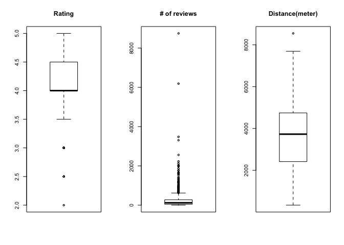
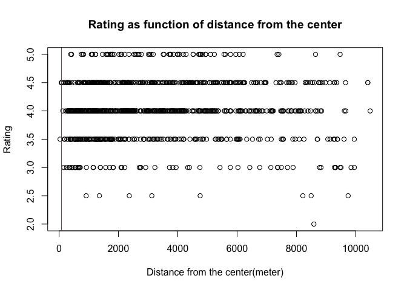

# Exploring YELP API


**At first, please note that if you haven't got the data directory, then the script will need to download the data from Yelp.  
In order to do so, please go to [yelp developers](https://www.yelp.com/developers/manage_api_keys) and create the credentials,
then, add your credentials to the `credentials.R.template` file, and rename it to `credentials.R`**  


## Including Plots

At first, we are gathering the Data. The code that we are using is:


```r
yelp_search <- function(term, location, category_filter, sort=0, offset=0, limit=20) {
  # Search term and location go in the query string.
  path <- "/v2/search/"
  query_args <- list(term=term,
                     location=location,
                     category_filter=category_filter,
                     sort=sort,
                     offset=offset,
                     limit=limit)
  
  # Make request.
  results <- yelp_query(path, query_args)
  return(results)
}

yelp_query <- function(path, query_args) {
  # Use OAuth to authorize your request.
  myapp <- oauth_app("YELP", key=consumerKey, secret=consumerSecret)
  sig <- sign_oauth1.0(myapp, token=token, token_secret=token_secret)
  
  # Build Yelp API URL.
  scheme <- "https"
  host <- "api.yelp.com"
  yelpurl <- paste0(scheme, "://", host, path)
  
  # Make request.
  results <- GET(yelpurl, sig, query=query_args)
  
  # If status is not success, print some debugging output.
  HTTP_SUCCESS <- 200
  if (results$status != HTTP_SUCCESS) {
    print(results)
  }
  return(results)
}


if(! file.exists('data')){
  dir.create('data')
}


if(! file.exists('./data/business.csv')){
businesses = NULL
  for (offset in 0:(NUM_OF_PAGES-1)) {
    yelp_search_result <- yelp_search(term="food", category_filter="food", location="San Francisco, CA", sort=0, offset = offset*20)
    locationdataContent = content(yelp_search_result)
    locationdataList=jsonlite::fromJSON(toJSON(locationdataContent, auto_unbox = TRUE))
    tmp <- locationdataList$businesses
    tmp <- data.frame(tmp$name, tmp$rating, tmp$review_count, tmp$location$coordinate$latitude, tmp$location$coordinate$longitude)
    tmp <- rename(tmp, c("tmp.name"="name", "tmp.rating"="rating", "tmp.review_count"="review_count",
    "tmp.location.coordinate.latitude"="latitude", "tmp.location.coordinate.longitude"="longitude"))
    print(nrow(tmp))
    businesses <- rbind(businesses, tmp)
  }
  # Add a distance column that is calculated according to the Pythagorean theorem
  businesses$dist <- sqrt( (abs(businesses$longitude - (-122.4227)))^2 + (abs(businesses$latitude - (37.7770)))^2 )
  write.table(businesses, file='./data/business.csv')
} else{
  businesses <- read.table('./data/business.csv', header = TRUE)
}

cat(sprintf("Number of rows: %i", nrow(businesses)))
```

```
## Number of rows: 1000
```
Note that we have 1000 rows.  


Now, some plots:  


  
We thought that we would see some trend in this graph, but we couldn't find any.  

-----------------


  
We expected the rating to be affected by the distance from the center, but it seems like there is no trend in this graph.

------------


  
We expected that the restaurants that are the closest to the center will have the most reviews, because the most pepole visit there.

--------------------


  
The histogram shows that indeed the central area which is at a radius of 30 ft, contains the most restaurants, and as we are getting further from
the center the number of restaurants gets smaller.  
This probably is also related to the fact that sea surrounds this area (as can be seen in the maps below)

-----------

Showing some maps:

```
## Map from URL : http://maps.googleapis.com/maps/api/staticmap?center=37.755,-122.425&zoom=12&size=640x640&scale=2&maptype=hybrid&language=en-EN&sensor=false
```


  
Here we can see the location of the restaurants that we have retrieved from yelp on a map

----

  
This is a Heat map that shows the central area.  
We can clearly see that indeed there is a central area in which most of the restaurants grouped, as the histogram shows
