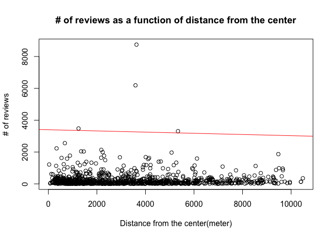
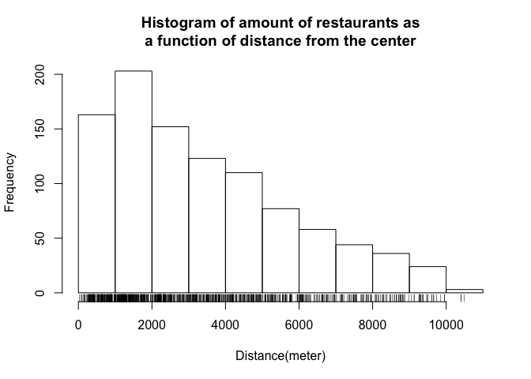

# Exploring YELP API


**At first, please note that if you haven't got the data directory, then the script will need to download the data from Yelp.  
In order to do so, please go to [yelp developers](https://www.yelp.com/developers/manage_api_keys) and create the credentials,
then, add your credentials to the `credentials.R.template` file, and rename it to `credentials.R`**  


At first, we are gathering the Data. The code that we are using is:


```r
yelp_search <- function(term, location, category_filter, sort=0, offset=0, limit=20) {
  # Search term and location go in the query string.
  path <- "/v2/search/"
  query_args <- list(term=term,
                     location=location,
                     category_filter=category_filter,
                     sort=sort,
                     offset=offset,
                     limit=limit)
  
  # Make request.
  results <- yelp_query(path, query_args)
  return(results)
}

yelp_query <- function(path, query_args) {
  # Use OAuth to authorize the request.
  myapp <- oauth_app("YELP", key=consumerKey, secret=consumerSecret)
  sig <- sign_oauth1.0(myapp, token=token, token_secret=token_secret)
  
  # Build Yelp API URL.
  scheme <- "https"
  host <- "api.yelp.com"
  yelpurl <- paste0(scheme, "://", host, path)
  
  # Make request.
  results <- GET(yelpurl, sig, query=query_args)
  
  # If status is not success, print some debugging output.
  HTTP_SUCCESS <- 200
  if (results$status != HTTP_SUCCESS) {
    print(results)
  }
  return(results)
}

# Create the data dir if it doesn't exist
if(! file.exists('data')){
  dir.create('data')
}

calc_dist <- function(i, data){
  if (is.na(data[i, 'latitude']) || is.na(data[i, 'longitude'])){
    NA
  }else{
    distm(c(data[i, 'longitude'], data[i, 'latitude']), c(-122.4250, 37.7550))
  }
}


if(! file.exists('./data/business.csv')){
businesses = NULL
  # The api serves a small amount of rows each time, so we are iterating over and over and building
  # a one big dataframe
  for (offset in 0:(NUM_OF_PAGES-1)) {
    yelp_search_result <- yelp_search(term="food", category_filter="food", location="San Francisco, CA", sort=0, offset = offset*20)
    
    # Parse data from the http response to a json
    yelp_data = content(yelp_search_result)
    yelp_data_list=jsonlite::fromJSON(toJSON(yelp_data, auto_unbox = TRUE))
    
    # Clean and rename the dataframe
    tmp <- yelp_data_list$businesses
    tmp <- data.frame(tmp$name, tmp$rating, tmp$review_count, tmp$location$coordinate$latitude, tmp$location$coordinate$longitude)
    tmp <- rename(tmp, c("tmp.name"="name", "tmp.rating"="rating", "tmp.review_count"="review_count",
    "tmp.location.coordinate.latitude"="latitude", "tmp.location.coordinate.longitude"="longitude"))
    
    # Merge with the previous data, for a one big dataset
    businesses <- rbind(businesses, tmp)
  }
  
  # Add a distance column that is calculated according to the Pythagorean theorem
  businesses$dist <- sapply(1:nrow(businesses), calc_dist, businesses)
  
  # Write the data to csv
  write.csv(businesses, file='./data/business.csv')
} else{
  businesses <- read.csv('./data/business.csv', header = TRUE)
}

cat(sprintf("Number of rows: %i", nrow(businesses)))
```

```
## Number of rows: 1000
```
Note that we have 1000 rows.  

The available features are

```
## [1] "X"            "name"         "rating"       "review_count"
## [5] "latitude"     "longitude"    "dist"
```


Head of the table:

```
##   X                         name rating review_count latitude longitude
## 1 1          Hot Sauce and Panko    4.5          669  37.7945 -122.4178
## 2 2 Roli Roti Gourmet Rotisserie    4.5         1169  37.7954 -122.3925
## 3 3                 The Chairman    4.5          246  37.7840 -122.4176
## 4 4         Good Mong Kok Bakery    4.0         1236  37.7955 -122.4085
## 5 5                   Lou's Cafe    4.5         1157  37.7804 -122.4731
## 6 6 The Italian Homemade Company    4.5          442  37.8018 -122.4119
##       dist
## 1 4442.524
## 2 5329.480
## 3 3293.284
## 4 4736.434
## 5 5090.252
## 6 5335.731
```


## Now, some plots:  

At first, box plots for the relevant features:

```r
par(mfrow=c(1,3))
boxplot(businesses$rating, main='Rating')
boxplot(businesses$review_count, main='# of reviews')
boxplot(businesses$dist, main='Distance(meter)')
```


  
- We can see that most of the ratings are at the range [4.0,4.5].  
- We can also see that most of the restaurants have a really small number of review.
- Last but not least, we can see that the distance from the center is distributed nicely, where
approximately half of the restaurants are between 0km to 4km from the center, and half are between
4km to 8km.

-----


```r
with(businesses, plot(x = review_count, y = rating, main='Rating as function of # of reviews', xlab= '# of reviews',
                                                           ylab='rating'))
# Add trend line
with(businesses, abline(lm(review_count~rating), col="red"))
```


  
We thought that we might see some trend in this graph, but we couldn't find any.  
We can also use `cor(businesses$review_count, businesses$rating)` and see that the correlation is -0.0328246
which is negligible.

-----------------


```r
plot(x=businesses$dist, y=businesses$rating, main='Rating as function of distance from the center', xlab="Distance from the center(meter)",
     ylab="Rating")

# Add trend line
abline(lm(businesses$dist~businesses$rating), col="red")
```


  
We thought that the rating might be affected by the distance from the center, but it seems like there is no trend in this graph.
Using `cor(...)` we see that also here the correlation is -0.1490322, which is neglible.

------------


```r
plot(businesses$dist, businesses$review_count, main='# of reviews as a function of distance from the center',
                      xlab='Distance from the center(meter)', ylab='# of reviews')

# Add trend line
abline(lm(businesses$dist~businesses$review_count), col="red")
```


  
We expected that the restaurants that are the closest to the center will have the most reviews, because the most pepole visit there.  
The correlation is -0.0175, which again, is neglible.

--------------------


```r
hist(businesses$dist, main = 'Histogram of amount of restaurants as\na function of distance from the center', xlab = 'Distance(meter)')
rug(businesses$dist)
```


  
The histogram shows that indeed the central area which is at a radius of 4-5 km, contains the most restaurants, and as we are getting further from
the center the number of restaurants gets smaller.  
This probably is also related to the fact that sea surrounds this area (as can be seen in the maps below)

-----------

Relevant maps:

  

  
Here we can see the location of the restaurants that we have retrieved from yelp on a map

----

  
This is a Heat map that shows the central area.  
We can clearly see that indeed there is a central area in which most of the restaurants grouped, as the histogram shows
